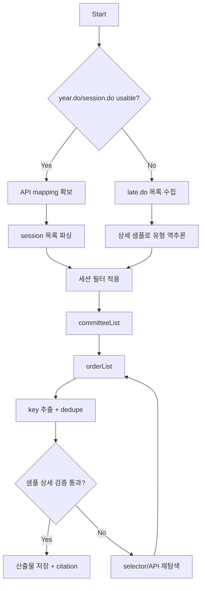

# scrape-council-minutes

대한민국 지방의회 회의록 페이지는 JS 트리(FancyTree) + lazy-load API + HTML 조각 응답을 섞어 쓰는 경우가 많다.
이 스킬은 화면 탐색을 최소화하고, API 우선으로 회기/위원회/차수/상세키를 안정적으로 수집하는 절차를 정의한다.

## 언제 쓰는가

- 특정 연도에서 마지막 정례회(또는 임시회)를 자동 판별해야 할 때
- 회기 단위로 모든 회의록 상세 URL(`recordView.do?key=...`)을 뽑아야 할 때
- 목록 페이지가 JS 렌더링이라 정적 fetch만으로는 누락이 발생할 때
- 다른 세션에서 재실행 가능한 수집 명세(입력/출력/검증)를 남겨야 할 때

## 입력/출력 계약

### 입력

| 필드 | 타입 | 필수 | 설명 |
|---|---|---|---|
| council_name | string | Y | 의회명 (예: 성남시의회) |
| year | number | N | 조회 연도 |
| session_filter | string | N | `정례회`/`임시회`/`전체` |
| target_session | number | N | 특정 회기 강제 지정 |

### 출력

| 필드 | 타입 | 설명 |
|---|---|---|
| sessions[] | array | 회기 메타(`th`,`session`,`session_type`,`date_range`) |
| committees[] | array | 위원회 메타(`code`,`title`,`session`) |
| records[] | array | 상세 회의록 메타(`key`,`detail_url`,`label`) |
| diagnostics | object | 호출 수, 실패 수, 파싱 실패 수, 중복 제거 수 |
| citations | array | URL, collected_at(KST), sha256 |

## 0단계: 작업 모드

- 응답/진행 로그는 caveman mode 사용.
- 긴 설명 대신 상태 + 근거 + 다음 행동만 기록.

## 1단계: 진입점 식별

우선 후보 URL 확인 (사례: 성남시의회):

1. `.../assembly/year.do` (연도별)
2. `.../assembly/session.do` (회기/대별)
3. `.../assembly/committee.do` (회의별)
4. `.../assembly/late.do` (최근회의록)

선택 우선순위:

1. `year.do`에서 회기유형 문자열이 직접 노출되면 최우선.
2. 없으면 `session.do`.
3. 둘 다 불가하면 `late.do + 상세 샘플 역추론`.

## 2단계: 트리/API 매핑 확보

Playwright로 페이지의 스크립트/네트워크를 확인해 트리 lazy-load 엔드포인트를 고정한다.

검증 항목:

1. 루트 노드 source JSON(`year`, `th`, `code` 등)
2. lazyLoad 분기(`mode` -> `url`)
3. 요청 파라미터 키 이름(`councilId`, `th`, `session`, `code`, `rid`)

성남시의회 관찰 기반 기준 예:

| mode | endpoint |
|---|---|
| sessionYear | `/record/sessionYearList.do` |
| committee | `/record/committeeList.do` |
| order | `/record/orderList.do` |
| item | `/record/itemList.do` |

## 3단계: 회기 목록 수집

### fast path (권장)

`sessionYearList` 응답으로 회기 목록 수집.

필수 파싱:

- `session` (회기번호)
- `th` (대수)
- `title`에서 회기 유형/기간

권장 정규식:

`^제(?<session>\d+)회\[(?<sessionType>[^\]]+)\]\((?<start>\d{4}\.\d{2}\.\d{2}\.)\s*~\s*(?<end>\d{4}\.\d{2}\.\d{2}\.)\)$`

### fallback path

`late.do` 목록만 있을 때:

1. 목록에서 회기별 대표 상세 1건 선택
2. 상세 헤더(`제XXX회 ... (정례회/임시회 ...)`) 파싱
3. 회기유형 매핑 캐시 생성

## 4단계: 회기 필터링 결정

분기:

1. `target_session` 지정 시 해당 회기만 유지.
2. `session_filter=정례회`이면 `sessionType`에 `정례회` 포함만 유지.
3. `session_filter=임시회`이면 `임시회` 포함만 유지.
4. `year + session_filter + last` 조합이면 session 번호 최대값 선택.

완료 조건:

- 필터 후 세션 수가 1개 이상.
- 0개면 근거 로그와 함께 종료.

## 5단계: 회기 -> 위원회 -> 차수 확장

각 세션에 대해:

1. `committeeList` 호출 -> `code` 목록 확보
2. 각 `code`별 `orderList` 호출
3. `orderList.title`의 anchor href에서 key 추출

권장 정규식:

`recordView\.do\?key=([a-f0-9]+)`

추출 결과:

- `key`
- `detail_url`
- `label` (예: 제1차(YYYY.MM.DD 요일))

## 6단계: 상세 페이지 확인(샘플 검증)

전체 상세를 모두 열 필요 없음. 세션당 최소 샘플 1~2건 확인.

검증 규칙:

1. `recordView.do?key=...` 접근 가능
2. 본문 컨테이너(`#canvas` 또는 대응 selector) 텍스트 길이 임계치 통과
3. 실패 시 selector 후보 재탐색 후 재검증

## 7단계: 품질 게이트

필수 체크:

1. 중복 key 제거 후 건수 기록
2. 세션별 committee code 수 vs order 호출 성공 수 비교
3. 파싱 실패 원문(`title`) 별도 보관
4. 실패 요청 URL/상태코드 목록 보관

권장 판정:

- `pass`: 목표 세션의 key 누락 없음
- `warn`: 일부 code 실패, 재시도 필요
- `fail`: 세션 식별 또는 key 추출 불가

## 8단계: 호출/속도 정책

1. robots.txt 선확인
2. 호스트당 최소 1 req/sec
3. 지수 백오프 재시도(5xx/429)
4. 동일 파라미터 API 결과 세션 캐시

## 9단계: 산출물 포맷

최소 산출물 3종:

1. 수집 요약 Markdown
2. machine-readable 목록(JSONL 또는 JSON)
3. 출처 메타(URL, collected_at(KST), sha256)

JSONL 레코드 권장 필드:

- `url` (detail URL)
- `session`
- `session_type`
- `committee_code`
- `committee_title`
- `label`
- `source_page`

## 10단계: 의사결정 트리

## 실패 대응 표

| 현상 | 원인 후보 | 대응 |
|---|---|---|
| 회기유형 미검출 | title 포맷 변경 | 정규식 완화 + 원문 보관 |
| orderList에 key 없음 | HTML 구조 변경 | href parser 교체, raw HTML 저장 |
| 상세 본문 비어있음 | 렌더링 지연/selector 변경 | 대기 후 재조회, 컨테이너 재탐색 |
| 호출 차단 | 과도한 빈도 | rate-limit 강화, 재시도 간격 증가 |

## 완료 기준

1. 목표 필터 기준 세션이 명시적으로 식별됨.
2. 각 세션에서 key 목록 추출 완료.
3. 중복 제거/실패 목록/파싱 실패 목록이 분리 저장됨.
4. 출처 메타(`url`,`collected_at`,`sha256`)가 누락 없음.

## scrape-council-schedule와의 관계

- 공통: JS 렌더링 사이트 탐색, Playwright 스냅샷, 연도/회기 구조 파악.
- 차이: 일정(skill)은 표 행 추출 중심, 회의록(skill)은 API 계층 + key 추출 중심.
- 권장 연계: 일정에서 회기번호 확보 -> 본 skill로 회의록 상세 수집.
