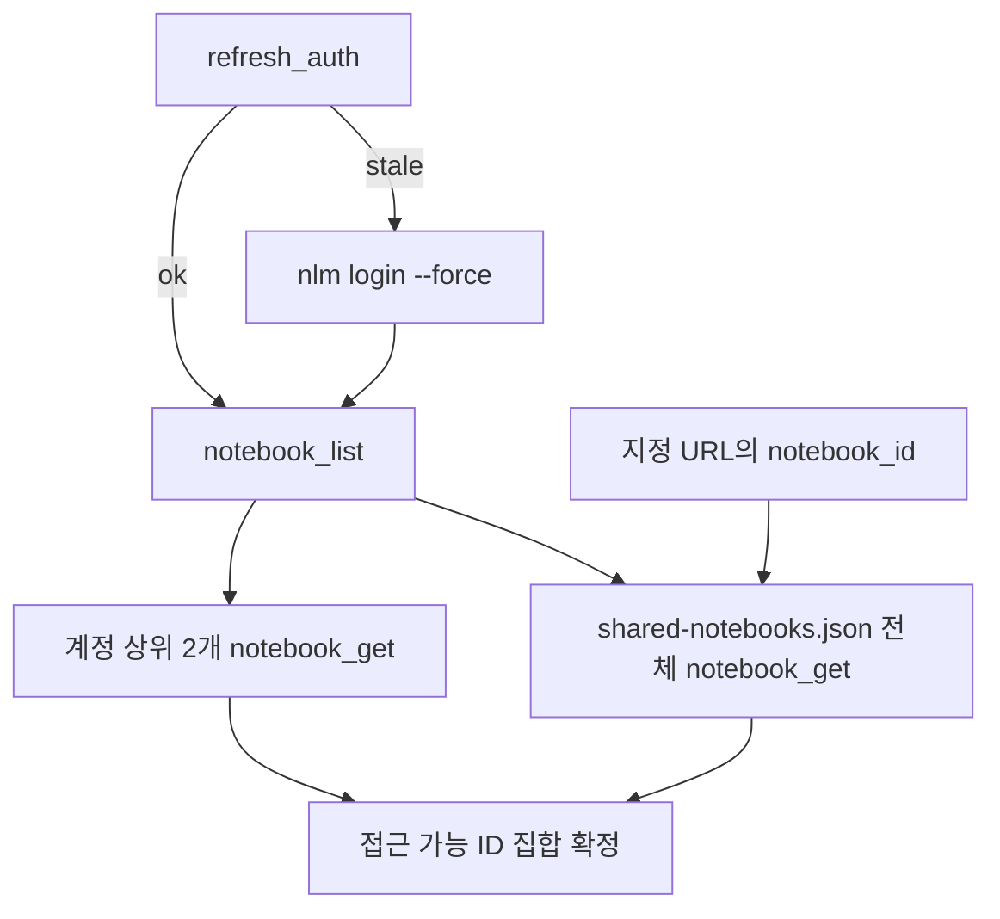
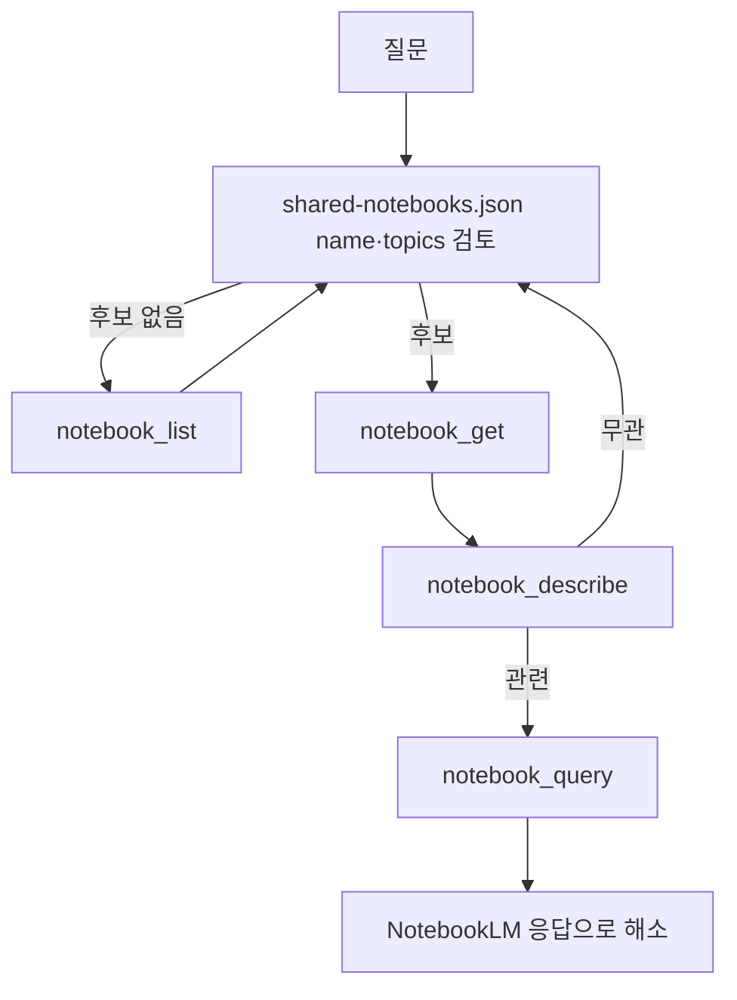

# setup-notebooklm-mcp

NotebookLM MCP를 설정·인증하고, 공유 노트북을 출처로 한 질의응답을 수행한다.

## 불변 규칙

- 실행은 항상 `uvx --from notebooklm-mcp-cli ...` 형태를 사용한다.
- 대상 노트북은 `notebooks/shared-notebooks.json`을 우선한다. `notebook_list`(계정 전체)는 보조 확인용이다.
- 모든 `notebook_id`는 `notebook_get` 성공으로 접근 가능성을 검증한 뒤 사용한다.
- 인증 실패 시 MCP `refresh_auth`만 반복하지 않는다. 필요하면 같은 셸 세션에서 `nlm login --force`를 실행한다.
- 노트북 답변은 `notebook_query` 결과를 근거로 제시한다. 임의 추정으로 보완하지 않는다.

## 사전 확인

1. `notebooks/README.md`, `notebooks/shared-notebooks.json`을 읽는다.
2. MCP 설정에서 NotebookLM 서버가 아래 명령으로 실행되는지 확인한다.

```json
{ "command": "uvx", "args": ["--from", "notebooklm-mcp-cli", "notebooklm-mcp"] }
```

## CLI 명령 (uvx)

```pwsh
uvx --from notebooklm-mcp-cli nlm login          # 인증
uvx --from notebooklm-mcp-cli nlm doctor         # 진단
# 세션 격리 회피: 같은 셸에서 재인증 후 목록 조회
uvx --from notebooklm-mcp-cli nlm login --force 2>&1
if ($LASTEXITCODE -eq 0) { uvx --from notebooklm-mcp-cli nlm notebook list 2>&1 }
```

## 인증 IF-THEN

- IF `auth_status=stale` 또는 `Authentication expired` / `401` / `403` THEN `nlm login --force` 후 `refresh_auth`.
- IF `auth_status=unverified` AND 직전 MCP 호출 성공 THEN 재로그인 강제하지 않고 네트워크만 점검.
- IF 다중 계정 THEN `nlm login --profile <name>`으로 분리.
- IF MCP가 다른 계정으로 붙어야 함 THEN `nlm login switch <profile>` 후 MCP 재호출.
- IF MCP 설정에 `NOTEBOOKLM_COOKIES`/`NOTEBOOKLM_CSRF_TOKEN`/`NOTEBOOKLM_SESSION_ID` THEN 제거(자동 추출과 충돌).
- IF 조직 도메인 THEN `NOTEBOOKLM_BASE_URL` 설정 후 로그인.
- IF 자동 브라우저 인증 실패 THEN 브라우저 완전 종료 후 재시도, 지속 실패 시 `nlm login --manual`.

## 세션 내 MCP 기능 사용 흐름

### A. 인증 확보 + 노트북 접근 검증

순서: `refresh_auth` → (필요 시 `nlm login --force`) → `notebook_list` → `notebook_get`.



검증 대상:

1. 로그인 계정 노트북 **상위 2개** (`notebook_list` 순서 기준).
2. `notebooks/shared-notebooks.json`의 **모든** `notebook_id`.
3. 사용자가 NotebookLM URL을 지정하면 그 URL의 `notebook_id`도 포함.

### B. 질문 → 관련 노트북 질의 → 해소

사용자에게 노트북을 되묻기 전에 후보를 먼저 탐색한다. `notebook_describe`는 노트북 소스를 근거로 질의응답을 수행하므로 관련성 판단에 사용한다.

순서: 메타 검토 → `notebook_get` → `notebook_describe` → `notebook_query`.



근거 보강이 필요하면 `source_get_content` 또는 `source_describe`로 원문을 확인한다. 복수 노트북 비교가 필요하면 `cross_notebook_query`를 사용한다.

## 완료 체크리스트

- [ ] MCP 서버가 `uvx --from notebooklm-mcp-cli notebooklm-mcp`로 실행된다.
- [ ] `nlm login`, `nlm doctor` 성공.
- [ ] 계정 상위 2개 + `shared-notebooks.json` 전체 + 지정 URL을 `notebook_get`으로 검증.
- [ ] 최소 1회 `notebook_query` 정상 응답.
- [ ] 인증 오류 시 IF-THEN에 따라 재인증/프로필 전환 수행.

## 참고

- 기준 문서: `notebooks/README.md`
- 대상 목록: `notebooks/shared-notebooks.json`
- 도구 정의: <https://raw.githubusercontent.com/jacob-bd/notebooklm-mcp-cli/main/src/notebooklm_tools/mcp/tools/__init__.py>
