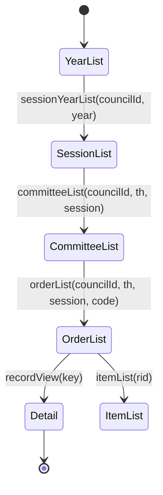

# 성남시의회 회의록 웹페이지 동작

## 0. 문서 목적
이 문서 목표: 성남시의회 회의록 탐색 동작을 화면 기준 + HTTP 기준으로 고정 명세화.
용도: 다음 세션에서 바로 재사용. 구현 언어/도구 무관.
주의: 이 문서는 홈페이지 동작만 기록. 특정 스크립트 구현 세부는 비포함.

## 1. 스코프
1. 포함
   - 회기 식별 방법.
   - 회기 유형(정례회/임시회) 판별 방법.
   - 회기 -> 위원회 -> 차수 -> 회의록 상세 URL(key) 추출 경로.
   - 화면 트리(FancyTree)와 실제 lazy-load API 매핑.
2. 제외
   - 파일 저장 포맷/저장 경로 구현.
   - 특정 코드베이스 함수명, 클래스명, CLI 옵션.

## 2. 진입 URL
| 구분 | URL | 역할 |
|---|---|---|
| 최근 회의록 | https://www.sncouncil.go.kr/kr/assembly/late.do | 최신 항목 중심 목록. 회기 유형 판별에 비효율 가능. |
| 회기별 | https://www.sncouncil.go.kr/kr/assembly/session.do | 대(代) 중심 트리. |
| 연도별 | https://www.sncouncil.go.kr/kr/assembly/year.do | 연도 중심 트리. 회기 유형 판별 최적. |
| 회의별 | https://www.sncouncil.go.kr/kr/assembly/committee.do | 위원회 분류 중심 트리. |
| 상세 | https://www.sncouncil.go.kr/record/recordView.do?key={KEY} | 최종 본문 페이지. |

## 3. 핵심 결론
1. 회기 유형 판별 1순위: year.do 기반 API.
2. 이유
   - 회기 노드 title 안에 유형 직접 포함.
   - 예: 제307회[제2차 정례회](2025.11.20. ~ 2025.12.18.)
3. 비권장
   - late.do만 사용 후 상세 1건 샘플 fetch로 유형 역추론.
   - 가능은 하나 호출 수 증가.

## 4. 화면-API 매핑 (FancyTree lazy-load)
year.do, session.do, committee.do 공통 패턴: 트리 노드 클릭 -> mode에 따라 JSON API 호출.

| mode | API | 요청 파라미터 | 응답 의미 |
|---|---|---|---|
| sessionYear | /record/sessionYearList.do | councilId, year | 연도 내 회기 목록 |
| committee | /record/committeeList.do | councilId, th, session | 회기 내 위원회 목록 |
| order | /record/orderList.do | councilId, th, session, code | 위원회 내 차수 목록(링크 HTML 포함) |
| item | /record/itemList.do | rid | 안건 목록 |

관찰된 lazyLoad 분기 요약:
1. mode=sessionYear -> /record/sessionYearList.do
2. mode=committee -> /record/committeeList.do
3. mode=order -> /record/orderList.do
4. mode=item -> /record/itemList.do

## 5. 루트 트리 구조
### 5.1 year.do
1. 루트: YYYY년도 노드들.
2. 각 연도 확장 시: 회기 노드 리스트 반환.
3. 회기 노드 title에 회기유형 포함.

### 5.2 session.do
1. 루트: 제N대(기간, 회기범위).
2. 각 대 확장 시: 회기 노드.
3. 회기 노드 title에 회기유형 포함.

### 5.3 committee.do
1. 루트 1차: 본회의/상임위원회/예결특위/특별위원회/행정사무감사/행정사무조사.
2. 이후: 대(代) -> 회기 -> 위원회/차수.
3. 목적: 위원회 축 탐색. 회기 유형만 필요하면 year.do가 단순.

## 6. 응답 데이터 계약
### 6.1 sessionYearList 응답 원소
| 필드 | 타입 | 예 |
|---|---|---|
| mode | string | committee |
| folder | string | true |
| th | number | 9 |
| lazy | string | true |
| session | number | 307 |
| councilId | string | SEONGNAM |
| title | string | 제307회[제2차 정례회](2025.11.20. ~ 2025.12.18.) |

### 6.2 committeeList 응답 원소
| 필드 | 타입 | 예 |
|---|---|---|
| mode | string | order |
| folder | string | true |
| code | string | A011 |
| th | number | 9 |
| lazy | string | true |
| session | number | 307 |
| councilId | string | SEONGNAM |
| title | string | 본회의 |

### 6.3 orderList 응답 원소
| 필드 | 타입 | 예 |
|---|---|---|
| title | string(HTML) | <a href='/record/recordView.do?key=...'>제1차(...)</a> |

주의: orderList는 JSON 내부에 HTML anchor 문자열을 담아 반환.

## 7. 파싱 규칙
### 7.1 회기 정보 파싱
입력: sessionYearList 원소.title

정규식 권장:
`^제(?<session>\d+)회\[(?<sessionType>[^\]]+)\]\((?<start>\d{4}\.\d{2}\.\d{2}\.)\s*~\s*(?<end>\d{4}\.\d{2}\.\d{2}\.)\)$`

출력 필드:
1. sessionNumber (int)
2. sessionTypeRaw (string) 예: 제2차 정례회, 임시회
3. startDateRaw, endDateRaw

### 7.2 정례회 판정
규칙: sessionTypeRaw가 "정례회" 포함 시 정례회.

### 7.3 상세 key 파싱
입력: orderList 원소.title (HTML)

정규식 권장:
`recordView\.do\?key=([a-f0-9]+)`

출력 필드:
1. key (hex string)
2. detailUrl = https://www.sncouncil.go.kr/record/recordView.do?key={key}

## 8. 표준 탐색 시나리오
### 8.1 특정 연도 마지막 정례회 찾기
1. GET /record/sessionYearList.do?councilId=SEONGNAM&year={YYYY}
2. title 파싱.
3. sessionType에 정례회 포함 항목만 필터.
4. session 번호 최대값 선택.

2025 검증 예:
1. 정례회 항목: 제303회[제1차 정례회], 제307회[제2차 정례회]
2. 마지막 정례회: 제307회

### 8.2 선택 회기의 모든 상세 페이지 key 수집
1. committeeList 호출: /record/committeeList.do?councilId=SEONGNAM&th={th}&session={session}
2. 각 code에 대해 orderList 호출.
3. 각 orderList 원소 HTML에서 key 추출.
4. key dedupe.

### 8.3 회기 전체 커버리지 검증
1. 수집한 key set 크기 기록.
2. 회기별 위원회 code별 원소 수 합계와 비교.
3. 누락 있으면 code 단위 재조회.

## 9. 상태 전이 모델

## 10. 실패/예외 처리 규칙
1. HTTP 실패(5xx/429)
   - 지수 백오프 재시도.
   - 최대 시도 횟수 초과 시 실패 목록 보존.
2. 파싱 실패(title 형식 변경)
   - 원문 title 저장.
   - 파싱 실패 레코드 별도 큐.
3. orderList HTML 구조 변경
   - anchor href 없음 감지 시 경고.
   - fallback: title 원문 저장 + 수동검토 대상.
4. 중복 key
   - set dedupe 필수.

## 11. 호출 정책
1. robots.txt 확인 선행.
2. 호스트별 최소 1 req/sec 유지.
3. 세션 단위 캐시 권장
   - sessionYearList(year)
   - committeeList(th,session)
   - orderList(th,session,code)

## 12. 재사용 인터페이스 (권장)
### 12.1 입력
| 필드 | 타입 | 설명 |
|---|---|---|
| year | number | 회기 조회 연도 |
| councilId | string | 기본값 SEONGNAM |
| sessionTypeFilter | string | 예: 정례회, 임시회 |

### 12.2 출력
| 필드 | 타입 | 설명 |
|---|---|---|
| sessions[] | array | 회기 메타(th, session, type, dateRange) |
| keys[] | array | detail key 목록 |
| detailUrls[] | array | recordView URL 목록 |
| diagnostics | object | 호출수, 실패수, 파싱실패수 |

## 13. 관찰 기반 스냅샷 예시
1. year.do 트리 항목 예시
   - 2026년도
   - 제310회[임시회](2026.04.16. ~ 2026.04.22.)
   - 2025년도
   - 제307회[제2차 정례회](2025.11.20. ~ 2025.12.18.)
2. committeeList(307회) 예시 code
   - A011 본회의
   - C011 의회운영위원회
   - C030 행정교육위원회
3. orderList(A011) 예시
   - 개회식(2025.11.20 목요일)
   - 제1차(2025.11.20 목요일)

## 14. 출처 메타데이터
collected_at (KST): 2026-06-12T19:40:03+09:00

| URL | SHA-256 |
|---|---|
| https://www.sncouncil.go.kr/kr/assembly/year.do | 7817bfc5369ca2bdf3a9eeab9f1fa6e71fe4302b3a66fde01d169280e15a45b9 |
| https://www.sncouncil.go.kr/kr/assembly/session.do | 738df582149cc77377ce69896a25c3a9d2287b937df43ea02a0437207d14aa2b |
| https://www.sncouncil.go.kr/kr/assembly/committee.do | 4f647968ede76a1a64e13bf499c09ccba4d94771fb57b558643956a26065aeeb |
| https://www.sncouncil.go.kr/record/sessionYearList.do?councilId=SEONGNAM&year=2025 | 70e7cba7cbe0e1bf67eccfb5b79143bf8a8bb7edcde555be9e21eea40bebcde4 |
| https://www.sncouncil.go.kr/record/committeeList.do?councilId=SEONGNAM&th=9&session=307 | 73a8f6c2d79d1c2c8fb75de68574d62eec3fb1e5c4b5c23fd6cf627dbe06aae8 |
| https://www.sncouncil.go.kr/record/orderList.do?councilId=SEONGNAM&th=9&session=307&code=A011 | 1507aa242cdc2b337c4f1356048ea8c9d2ca737dbef8aef1ea49e0b9c7f82442 |

## 15. 운영 메모
1. 회기 유형 판별은 year.do 계층 API만으로 종료 가능.
2. 상세 본문 수집은 orderList의 anchor key 추출 후 recordView 접근.
3. 사이트 구조 변경 가능성 상시 존재. 파싱 실패 레코드 분리 저장 필수.
