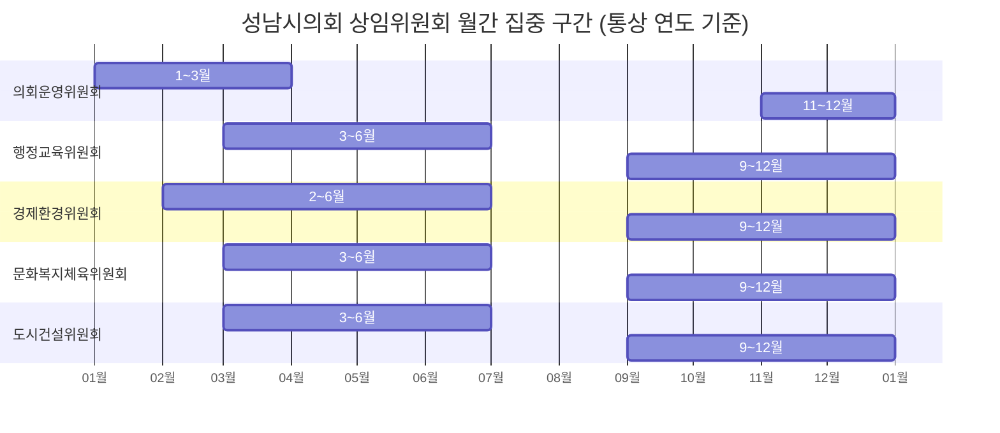
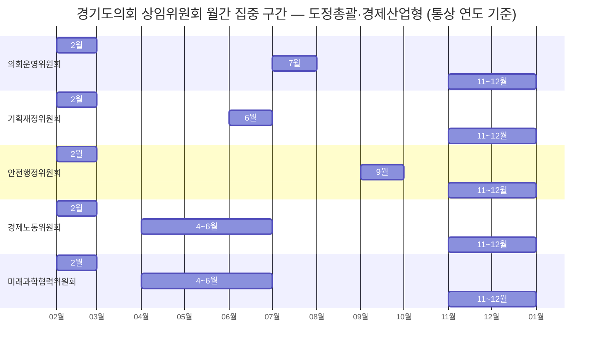
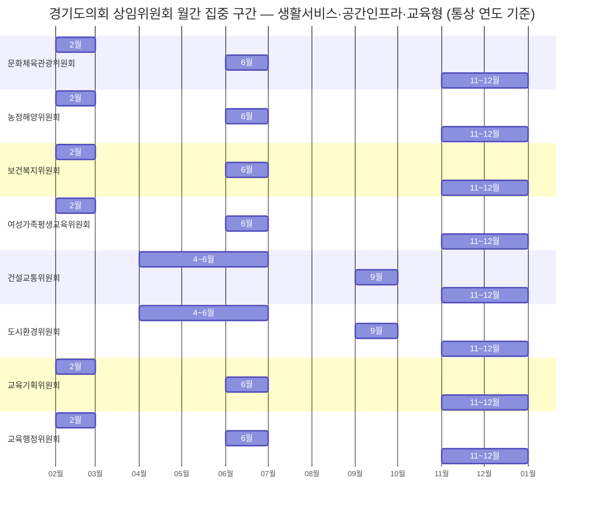

# 성남시의회·경기도의회 회기와 위원회 월간 타임라인

기준 시점: 2026-06-08. 성남시의회·경기도의회 회기 운영, 위원회 구조, 월별 업무 순서 정리. 2022~2026 일정: 공개 일정표·회의록 색인·기존 저장 문서 교차 확인. 미확인·예상 항목 ❓ 표기.

## 0. 범례

- 📌 법률(지방자치법·공직선거법) 또는 각 의회 조례로 집회일·기간이 고정된 항목
- ❓ 공식 일정표에서 확인되지 않은 항목 또는 직전 선거 주기 패턴을 바탕으로 예상한 일정

## 1. 제도 프레임

### 1.1 지방자치법 기준

- 📌 지방의회: 매년 2회 정례회 (지방자치법 제52조①)
- 임시회 소집 기준: 지방자치단체장, 조례로 정한 수 이상의 의원 요구
- 연간 회의 총일수·정례회·임시회 회기: 각 의회 조례로 확정 (지방자치법 제56조②)
- 상임위원회: 소관 의안·청원 심사. 특별위원회: 특정 안건 심사
- 📌 행정사무감사: 시·군·자치구의회 연 1회 9일 이내, 시·도의회 연 1회 14일 이내 (지방자치법 제49조①)
- 📌 최초 임시회(원구성) 소집 기한: 의원 임기 개시일 +25일 이내 (지방자치법 제53조①)
- 📌 의장·부의장 선거: 최초집회일 실시 (지방자치법 제57조②)

### 1.2 성남시의회와 경기도의회의 차이

| 항목 | 성남시의회 | 경기도의회 |
|---|---|---|
| 의회 급 | 기초의회 | 광역의회 |
| 📌 정례회 집회일 (조례) | 제1차 6월 1일, 제2차 11월 20일 | 제1차 6월 두 번째 화요일, 제2차 11월 첫 번째 화요일 |
| 연간 회의일수 상한 | 110일 | 140일 |
| 임시회 1회 최대일수 | 15일 | 20일 |
| 📌 행정사무감사 (지방자치법 제49조①) | 제2차 정례회 중 9일 이내 | 정례회 중 14일 이내 |
| 상임위원회 수 | 5개 | 13개 |

### 1.3 용어설명

- 회기: 의회 회의 기간. 정례회·임시회 포함
- 정례회: 조례 일정 기준 정기 회기. 이 문서에서는 6월·11월 전후 정기 회기
- 임시회: 특정 안건·현안 처리 목적으로 필요시 소집
- 비회기: 정례회·임시회 미개회 기간. 자료 정리·간담회·현장점검 주 활동

## 2. 2022~2026 월간 회기 참고표

- 일자 출처: [성남시의회 연간의사일정](https://www.sncouncil.go.kr/kr/news/cmsYear.do), [경기도의회 연간회기일정](https://www.ggc.go.kr/site/main/schedule/year/list)
- 원구성 시기(전국동시지방선거 해 7월): §2.0 주 단위 상세
- 📌 법률·조례 고정 일정, ❓ 미확인·예상 일정

### 2.0 제8·9회 전국동시지방선거 이후 원구성 주별 상세

2022(제8회·2022-06-01 실제) / 2026(제9회·2026-06-04 ❓예상) 원구성 일정 대조.

| 주차 | 날짜 | 성남시의회 (9대 / ❓10대) | 경기도의회 (11대 / ❓12대) |
|---|---|---|---|
| 1주 | 2022-07-01 (금) | 📌 제9대 의원 임기 개시 (공직선거법 제14조③) | 📌 제11대 의원 임기 개시 |
| 1주 | ❓ 2026-07-01 (수) | ❓📌 제10대 의원 임기 개시 | ❓📌 제12대 의원 임기 개시 |
| 2주 | 2022-07-04~08 | 사무국, 최초 임시회 소집 공고 준비 (📌 집회일 3일 전 공고 의무, 법 제54조④) | 사무처, 소집 공고 준비 |
| 2주 | ❓ 2026-07-01~07 | ❓ 소집 공고 준비 | ❓ 소집 공고 준비 |
| 3주 | 2022-07-08~26 | 📌 제273회 임시회(원구성) — 의장·부의장 선거, 상임위원회 및 특별위원회 구성 | 제361회 임시회 2022-07-12 집회 — 📌 의장·부의장 선거 실시 |
| 3~4주 | 2022-07-12~22 | 제273회 계속 — 상임위원 선임, 위원장 선거 | 제361회: 상임위원 선임, 위원장 선거, 도정업무보고 |
| 4주 | 2022-07-25 | 📌 최초 임시회 소집 법정 마감 (임기 개시 +25일, 법 제53조①) | 제361회 회기 계속 |
| 4~5주 | 2022-07-26~31 | 제273회 종료(07-26) | 제361회 종료 2022-07-31 |
| 4~5주 | ❓ 2026-07-07~22 | ❓ 제10대 원구성 진행 (의장·부의장·상임위원 선임) | ❓ 제392회 임시회(07-07~07-22), 의장·부의장 선거·상임위 선임 |
| 법정 마감 | ❓📌 2026-07-26 | ❓📌 최초 임시회 소집 법정 마감 추정 | 제392~394회 공식 연간회기일정 공개 |

> **비고**: 성남시의회 2022 원구성 회기번호 - 공식 연간의사일정 확인. 2026년 7월~ 일정 - 공식 페이지에서 제10대 의회 구성 후 결정 예정으로 표기.

### 2.1 2022년

1~6월: 제8대 성남시의회·제10대 경기도의회 임기 구간 (범위 외)

| 월 | 성남시의회 | 경기도의회 |
|---|---|---|
| 1~6월 | 제8대 의회 임기 (범위 외) | 제10대 의회 임기 (범위 외) |
| 7월 | 제273회 임시회(07.08~07.26) — 의장·부의장 선거, 상임위원회 및 특별위원회 구성, 상임위원장 및 특별위원장 선거 | 제361회 임시회(07-12~07-31) — 📌 의장·부의장 선거(07-12), 상임위 선임, 도정업무보고 |
| 8월 | 제274회 임시회(08.26~09.06) — 교섭단체 대표연설, 행정사무처리상황 청취 | 제362회 임시회(08-09~08-18) — 조례안·추경 |
| 9월 | 제274회 임시회 계속(09.01~09.06) — 교섭단체 대표연설, 행정사무처리상황 청취 | 제363회 임시회(09-20~10-07) — 대집행부 질문·조례안 |
| 10월 | 제275회 제1차 정례회(10.07~10.21) — 결산·추경·행감계획 | 제363회 후속(~10-07), 제364회 임시회(10-21) |
| 11월 | 제276회 제2차 정례회(11.21~12.23) — 행정사무감사·2023 예산안 | 제365회 제2차 정례회 개시(📌 11-01, 조례: 11월 첫째 화요일) — 📌 행감(11-04~11-17, 14일 이내)·2023 예산안 |
| 12월 | 제276회 계속(12.23 종료), 제277회 임시회(12.26~12.30) — 2023 예산안·기금운용계획 종합심사 | 제365회 제2차 정례회 종료(12-17), 2023 예산안 의결 |

### 2.2 2023년

| 월 | 성남시의회 | 경기도의회 |
|---|---|---|
| 1월 | 제278회 임시회(01.12~01.13), 제279회 임시회(01.27~02.06) | 비회기 또는 2월 임시회 준비 |
| 2월 | 제279회 임시회 계속(02.06까지) | 제366회 임시회(02-07~02-14) — 업무보고·대표연설·1분기 질문 |
| 3월 | 제280회 임시회(03.10~03.14) | 제367회 임시회(03-14~03-23) — 결산검사위원 선임·조례안 |
| 4월 | 제281회 임시회(04.11~04.18) | 제368회 임시회(04-20~04-27) — 추경예산안·조례안 |
| 5월 | 제1차 정례회 준비 | 제1차 정례회 준비 |
| 6월 | 제282회 제1차 정례회(06.01~06.15), 제283회 임시회(06.20~06.21) | 제369회 제1차 정례회(📌 06-13~06-28, 조례: 6월 둘째 화요일) — 2022 결산·추경 |
| 7월 | 제284회 임시회(07.14~07.18) | 제370회 임시회(07-11~07-18) — 업무보고·조례안 |
| 8월 | 비회기 | 비회기 |
| 9월 | 제285회 임시회(09.11~09.19), 제286회 임시회(09.26~10.10, 미개회·자동폐회) | 제371회 임시회(09-05~09-21) — 3분기 질문·추경·행감계획 |
| 10월 | 제287회 임시회(10.19~11.02) | 제2차 정례회 준비 |
| 11월 | 제288회 임시회(11.13), 제289회 제2차 정례회(11.20~12.11) | 제372회 제2차 정례회 개시(📌 11-07, 조례: 11월 첫째 화요일) — 📌 행감(14일 이내)·2024 예산안 |
| 12월 | 제289회 제2차 정례회 계속(12.11 종료) — 2024 예산안·행감 | 제372회 제2차 정례회 종료(12-21), 2024 예산안 의결 |

### 2.3 2024년

| 월 | 성남시의회 | 경기도의회 |
|---|---|---|
| 1월 | 제290회 임시회(01.22~01.30) | 비회기 또는 2월 임시회 준비 |
| 2월 | 비회기 | 제373회 임시회 준비 |
| 3월 | 제291회 임시회(03.04~03.11) | 비회기 |
| 4월 | 제292회 임시회(04.17~04.22) | 제373회 임시회 후속, 제374회 임시회(04.16~04.26) |
| 5월 | 제1차 정례회 준비 | 제1차 정례회 준비 |
| 6월 | 제293회 제1차 정례회(06.03~06.17), 제294회 임시회(06.26~06.28) | 제375회 제1차 정례회(📌 06.11~06.27, 조례: 6월 둘째 화요일) — 결산·추경 |
| 7월 | 제295회 임시회(07.17~07.22) | 제376회 임시회(07.19~07.26) — 의장단·상임위 선임 |
| 8월 | 비회기 | 비회기 또는 9월 임시회 준비 |
| 9월 | 제296회 임시회(09.23~10.01) | 제377회 임시회(09.02~09.13) — 질문·추경·행감계획 |
| 10월 | 제297회 임시회(10.23~10.28) | 제378회 임시회(09.23) 후속, 정례회 준비 |
| 11월 | 제298회 제2차 정례회(11.20~12.17) | 제379회 제2차 정례회 개시(📌 11.05~), 행감(📌 14일 이내)·2025 본예산 |
| 12월 | 제298회 제2차 정례회 계속(12.17 종료) | 제379회 정례회 종료(12.19), 제380·381회 1일 임시회 |

### 2.4 2025년

| 월 | 성남시의회 | 경기도의회 |
|---|---|---|
| 1월 | 제299회 임시회(01.02) | 제382회 임시회 준비 |
| 2월 | 제300회 임시회(02.07~02.17), 교섭단체 대표연설·업무보고 | 제382회 임시회(02.11~02.20) — 업무보고·대표연설·1분기 질문 |
| 3월 | 제301회 임시회(03.13~03.19), 결산검사위원 선임·추경예산안 | 비회기 또는 4월 임시회 준비 |
| 4월 | 제302회 임시회(04.17~04.21) | 제383회 임시회(04.08~04.15) — 추경·조례안 |
| 5월 | 비회기 | 제1차 정례회 준비 |
| 6월 | 제303회 제1차 정례회(06.02~06.16) | 제384회 제1차 정례회(📌 06.10~06.27, 조례: 6월 둘째 화요일) — 결산·추경 |
| 7월 | 제304회 임시회(07.17~07.21) | 제385회 임시회(07.15~07.23) — 업무보고·조례안 |
| 8월 | 비회기 | 비회기 |
| 9월 | 제305회 임시회(09.12~09.22) | 제386회 임시회(09.05~09.19) — 3분기 질문·추경·행감계획 |
| 10월 | 제306회 임시회(10.17~10.21) | 제2차 정례회 준비 |
| 11월 | 제307회 제2차 정례회(11.20~12.18) | 제387회 제2차 정례회 개시(📌 11.04~), 행감(📌 14일 이내)·2026 예산안 |
| 12월 | 제307회 제2차 정례회 계속(12.18 종료) | 제387회 제2차 정례회 종료(12.26) |

### 2.5 2026년

| 월 | 성남시의회 | 경기도의회 |
|---|---|---|
| 1월 | 제308회 임시회(01.23~02.02), 대표연설·업무계획 청취 | 비회기 또는 2월 임시회 준비 |
| 2월 | 제308회 종료, 상임위 업무계획 검토 | 제388회 임시회(02.03~02.12) — 업무보고·대표연설·1분기 질문·결산검사위원 선임 |
| 3월 | 제309회 임시회(03.12~03.16), 결산검사위원 선임·의안 심사 | 비회기 또는 4월 임시회 준비 |
| 4월 | 제310회 임시회(04.16~04.20), 의안 심사 | 제389회 임시회(04.21~04.30) — 추경·조례안 |
| 5월 | 지방선거 전환기, 6월 정례회 준비 | 제390회 임시회(05.12) — 추경·조례안 |
| 6월 | 📌 제1차 정례회 집회일 06-01 (조례). 2026년 7~12월 일정은 제10대 의회 구성 이후 결정 예정 | 제391회 제1차 정례회(06.09~06.24) — 2025 결산·예비비·추경 |
| 7월 | ❓ 제10대 의회 원구성 임시회 (2022 패턴 기반: 07-01 임기 개시 후 07-25 이내 개회) | 제392회 임시회(07.07~07.22) — 의장·부의장 선거, 상임위 선임, 상임위원장 선거, 도정 및 교육행정 업무보고, 교섭단체 대표의원 연설(하반기), 예결특위·윤리위 위원 선임 |
| 8월 | ❓ 제10대 의회 상임위별 현안 정리 시기 | 비회기 |
| 9월 | ❓ 신임 의회 체제 임시회 (조례·추경) | 제393회 임시회(09.01~09.18) — 대집행부 질문(3/4분기), 2026 추경예산안 심의, 행정사무감사 계획 승인 |
| 10월 | ❓ 행정사무감사·예산안 심의 준비 구간 | 비회기 또는 제2차 정례회 준비 |
| 11월 | ❓📌 제2차 정례회(조례: 11-20~), 행감(📌 9일 이내)·2027 예산안 | 제394회 제2차 정례회(11.03~12.17) — 대집행부 질문(4/4분기), 행정사무감사(14일), 2027 예산안 및 2026 추경예산안 심의 |
| 12월 | ❓ 예산안·추경·시정요구 정리 구간 | 제394회 제2차 정례회 계속(12.17 종료), 조례안 등 안건 심의 |

## 3. 성남시의회 위원회 구조

### 3.1 상임위원회

| 위원회 | 2026-06 확인 기준 구성 | 핵심 역할 | 월간 집중 구간 |
|---|---|---|---|
| 의회운영위원회 | 위원장 강상태, 부위원장 김보미, 13명 | 의회 운영, 의회사무국, 의회 조례·규칙, 의정비·윤리·복무 | 1~3월, 11~12월 |
| 행정교육위원회 | 위원장 미확인, 부위원장 추선미, 9명 | 공보·감사·재난안전, 행정기획조정, 교육·청소년·평생교육, 도서관 | 3~6월, 9~12월 |
| 경제환경위원회 | 위원장 조우현, 부위원장 김보석, 9명 | AI혁신, 재정경제, 환경정책·자원순환·기후에너지, 공유재산, 산업진흥 | 2~6월, 9~12월 |
| 문화복지체육위원회 | 위원장 안극수, 부위원장 박기범, 11명 | 복지, 보건, 공공의료, 문화, 체육, 민간위탁 복지시설 | 3~6월, 9~12월 |
| 도시건설위원회 | 위원장 박은미, 부위원장 최종성, 11명 | 도시계획, 정비사업, 교통도로, 개발사업, 도시개발공사 | 3~6월, 9~12월 |

### 3.2 특별위원회

| 위원회 | 확인 기준 구성 | 기능 |
|---|---|---|
| 예산결산특별위원회 | 위원장 김종환, 부위원장 이군수 포함 | 각 상임위 예비심사 뒤 올라온 예산안·결산·기금안을 종합조정 |
| 윤리특별위원회 | 위원장 김선임, 부위원장 민영미 포함 | 의원 윤리 위반 및 징계 사안 심사 |
| 재개발·재건축 신속추진 특별위원회 | 2026-04-15 제309회 8차 회의록 확인 | 특정 현안형 비상설 특별위원회 |

### 3.3 성남시의회 상임위별 업무 순서

의안처리절차:

발의·제출 → 접수 → 조례안예고 → 상임위원회 회부 → 전문위원 검토보고 → 질의·토론·의결 → 본회의 심사보고·의결 → 집행기관 이송 → 공포 또는 재의요구

상임위별 업무 흐름:

| 위원회 | 회기 전 | 회기 초 | 상임위 심사 | 회기 말 | 비회기 |
|---|---|---|---|---|---|
| 의회운영위원회 | 의회사무국 안건 정리, 규칙·조례 개정안 조율 | 대표연설·의사일정·의회 내부 규정 확인 | 윤리·복무·여비·정책지원관 등 내부 운영안 심사 | 본회의 보고안 정리 | 후속 규칙 손질 |
| 행정교육위원회 | 집행부 자료요구, 교육·청소년 현안 정리 | 소관 부서 업무보고 수령 | 조례안, 민간위탁, 동의안, 재난·행정 현안 심사 | 시정질문·행감 쟁점 정리 | 현장간담회, 자료축적 |
| 경제환경위원회 | 추경·결산·공유재산 자료 확보 | 재정경제·AI·환경 소관 보고 청취 | 세입·세출, 공유재산, 산업·환경 조례 심사 | 예결특위 이관 전 예비심사 | 출연기관 점검 |
| 문화복지체육위원회 | 복지·보건·문화 민간위탁 실적 점검 | 보건·복지·문화 분야 업무보고 | 복지사업 예산, 민간위탁, 문화체육 조례 심사 | 행감 지적사항 정리 | 시설 방문, 수탁기관 점검 |
| 도시건설위원회 | 개발사업·교통 현안 자료 확보 | 도시정비·교통도로 업무보고 | 정비사업, 교통, 공사·공단 안건 심사 | 예산·행감 쟁점 집중 | 현장 확인, 주민 민원 대응 |

### 3.4 성남시 기초의원 기준 월간 타임라인

- 성남시의회: 6월 - 결산·추경, 11~12월 - 행정사무감사·본예산 심의 집중
- 상임위별 소관: 행정교육(조직·안전·교육), 경제환경(재정·산업·환경), 문화복지(복지·보건·문화), 도시건설(개발·교통)
- 의회운영위원회 소관: 의회 내부 (의회 운영·사무국·조례·규칙·의정비·윤리·복무). 집행부 제외

| 월 | 통상 업무 |
|---|---|
| 1월 | 교섭단체 대표연설, 연초 업무계획 청취, 상임위별 핵심 현안 선정 |
| 2월 | 소관 부서 업무보고 후속 질의, 자료요구, 상반기 조례 발의 준비 |
| 3월 | 결산검사위원 선임, 1차 의안 심사, 결산자료 확인 |
| 4월 | 조례안·동의안 처리, 필요 시 예결특위 회부 전 예비심사 |
| 5월 | 제1차 정례회 대비 결산·예비비·추경 쟁점 정리 |
| 6월 | 제1차 정례회, 결산 승인, 예비비 승인, 추경 심사, 시정질문 |
| 7월 | 비회기 정책정리 또는 선거연도 원구성 대응 |
| 8월 | 지역현안 간담회, 행정사무감사 사전 의제 수집 |
| 9월 | 임시회 중심 조례·동의안·추경 심사 |
| 10월 | 행정사무감사 자료요구, 증인·참고인 검토 |
| 11월 | 제2차 정례회, 행정사무감사, 부서별 시정요구 정리 |
| 12월 | 본예산·추경 종합조정, 예결특위 결과 반영, 연말 의결 정리 |

## 4. 경기도의회 위원회 구조

### 4.1 상임위원회

| 위원회 | 핵심 역할 | 월간 집중 구간 |
|---|---|---|
| 의회운영위원회 | 의회사무처, 의회 운영, 도지사·교육감 비서·홍보 라인과의 연결 조정 | 2월, 7월, 11~12월 |
| 기획재정위원회 | 기획조정실, 균형발전, 평화협력, 감사위원회, 경기연구원 | 2월, 6월, 11~12월 |
| 경제노동위원회 | 노동, 경제, 사회혁신경제, 산하 경제기관 | 2월, 4~6월, 11~12월 |
| 안전행정위원회 | 안전관리, 자치행정, 소방, 자치경찰, 인권 | 2월, 9월, 11~12월 |
| 문화체육관광위원회 | 문화·체육·관광 및 관련 공공기관 | 2월, 6월, 11~12월 |
| 농정해양위원회 | 농업, 축산, 해양, 산림녹지 | 2월, 6월, 11~12월 |
| 보건복지위원회 | 복지, 보건, 공공의료, 사회서비스 | 2월, 6월, 11~12월 |
| 건설교통위원회 | 건설, 교통, 철도·항만, 공항추진 | 4~6월, 9월, 11~12월 |
| 도시환경위원회 | 도시주택, 도시개발, 환경, 수자원, GH | 4~6월, 9월, 11~12월 |
| 미래과학협력위원회 | AI, 국제협력, 미래산업, 테크노파크·경제과학진흥원 | 2월, 4~6월, 11~12월 |
| 여성가족평생교육위원회 | 여성가족, 평생교육, 도서관, 이민사회 | 2월, 6월, 11~12월 |
| 교육기획위원회 | 교육정책, 교육협력, 연구원, 유보통합 | 2월, 6월, 11~12월 |
| 교육행정위원회 | 교육행정, 감사, 운영지원, 인사, 인재개발 | 2월, 6월, 11~12월 |

### 4.2 특별위원회

| 위원회 | 구조 | 기능 |
|---|---|---|
| 예산결산특별위원회 | 상설 특별위원회 성격으로 반복 구성 | 상임위 예비심사 결과를 종합해 도 예산안·결산안 조정 |
| 윤리특별위원회 | 법정 특별위원회 | 의원 윤리·징계 사안 심사 |
| 비상설 특별위원회 | 특정 안건별 본회의 의결 설치 | 특별 현안, 조사, 제도개편 대응 |

### 4.3 경기도의회 상임위별 업무 순서

경기도의회: 연간 140일 상한, 상임위 13개. 질문·행감·예산 심의 상임위별 분담

업무보고·현안보고 → 소관 안건 접수 → 상임위 검토보고·질의·토론 → 예산안·추경안 예비심사 → (필요시) 예결특위 종합심사 → 본회의 의결 → 시정요구·집행점검

상임위 운영 패턴:

| 위원회군 | 회기 초 | 중간 | 회기 말 | 비회기 |
|---|---|---|---|---|
| 도정 총괄형: 의회운영·기획재정·안전행정 | 대표연설, 업무보고, 정책총괄 보고 | 질문·조례·조직개편 심사 | 본회의 보고안 정리 | 정책협의, 현장정책회의 |
| 경제산업형: 경제노동·미래과학협력 | 산업·투자·노동 현안 보고 | 추경, 출연기관 사업, 진흥기관 성과점검 | 예산 조정안 반영 | 기업·기관 현장 방문 |
| 생활서비스형: 문화체육관광·보건복지·여성가족평생교육 | 사업계획·서비스 현황 점검 | 민간위탁, 공공기관 운영, 복지·문화 조례 심사 | 행감 지적사항 정리 | 시설·기관 간담회 |
| 공간인프라형: 건설교통·도시환경·농정해양 | SOC·도시개발·환경·농정 현안 보고 | 추경, 공유재산·계획변경, 공사·공단 안건 심사 | 예산·행감 후속 정리 | 현장 확인, 민원 대응 |
| 교육형: 교육기획·교육행정 | 교육청 업무보고, 정책·행정 분리 점검 | 예산·정책사업·조직 운영 심사 | 행감·예산 지적사항 정리 | 학교·교육기관 현장 점검 |

### 4.4 경기도 광역의원 기준 월간 타임라인

- 경기도의회 회기 주요 구간: 2월 업무보고, 6월 결산, 9월 질문·행감계획, 11~12월 행감·본예산
- 경기도의회: 상임위 13개 소관 세분. 예산·행감 전 비회기 - 현장정책회의
- 2026년 7월 원구성: 의장단 선거·상임위 배정 → 하반기 의사일정 확정

| 월 | 통상 업무 |
|---|---|
| 1월 | 2월 임시회 준비, 소관 기관 업무현황 사전 파악 |
| 2월 | 업무보고, 교섭단체 대표연설, 1분기 대집행부 질문, 결산검사위원 선임 |
| 3월 | 추경안·조례안 준비, 산하기관 현안 점검 |
| 4월 | 추경예산안, 조례안, 출연기관 안건 심사 |
| 5월 | 추가 추경 또는 6월 정례회 대비 자료요구 |
| 6월 | 제1차 정례회, 결산·예비비·추경 심사 |
| 7월 | 원구성 또는 후반기 상임위 재편, 위원장 선거, 예결특위·윤리위 선임 |
| 8월 | 상임위별 현장정책회의, 하반기 입법 과제 정리 |
| 9월 | 3분기 대집행부 질문, 추경, 행정사무감사 계획 승인 |
| 10월 | 행정사무감사 자료요구, 기관별 현지확인, 증인 검토 |
| 11월 | 제2차 정례회, 행정사무감사 14일, 차년도 예산안 심사 |
| 12월 | 본예산·추경 종합의결, 시정요구·감사결과 정리 |

## 5. 출처 목록

- [지방자치법](https://www.law.go.kr/법령/지방자치법) — 제49조①(행정사무감사), 제52~57조(정례회·임시회·원구성), 제56조②(회기 총일수) · 수집 2026-06-04
- [공직선거법](https://www.law.go.kr/법령/공직선거법) — 제14조③(의원 임기 개시일) · 수집 2026-06-08
- [성남시의회 연간의사일정](https://www.sncouncil.go.kr/kr/news/cmsYear.do) — 2022~2026 연도별 표 직접 확인 · 수집 2026-06-08
- [성남시의회 의안처리절차](https://www.sncouncil.go.kr/kr/intro/cmsFunction4.do) · 수집 2026-06-04
- [성남시의회 회의별 회의록](https://www.sncouncil.go.kr/kr/assembly/committee.do) · 수집 2026-06-04
- [성남시의회 위원회별 의원 소개](https://www.sncouncil.go.kr/kr/member/active3.do) · 수집 2026-06-01
- [성남시의회 의회구성도](https://www.sncouncil.go.kr/kr/intro/cmsOrg.do) · 수집 2026-06-01
- [경기도의회 연간회기일정](https://www.ggc.go.kr/site/main/schedule/year/list) — 2026 연간회기일정 직접 확인 · 수집 2026-06-08
- [경기도의회 상임위원회 목록](https://www.ggc.go.kr/site/main/committee/stndnCmt?cmtCd=01) · 수집 2026-06-04
- [경기도의회 회기별 회의록 색인 (KMS)](https://kms.ggc.go.kr/svc/cms/mnts/MntsTreeSesnList.do) — 제361~372회(2022~2023) 집회일·종료일 직접 확인 · 수집 2026-06-08
- [성남시의회 위원회 상세 분석](보관함/결과/2026-06%20경기도%20성남시%20성남시의회%20위원회%20분석.md) — 내부 재사용 문서
- KMS(경기도의회 회의록 관리시스템)

## 6. 확인 제한

- 성남시의회 연간의사일정: 동적 페이지. 2022~2026 연도별 표 - Playwright로 직접 확인
- 성남시의회 2026년 7~12월: 공식 페이지에서 제10대 의회 구성 후 결정 예정으로 표기 → ❓ 유지
