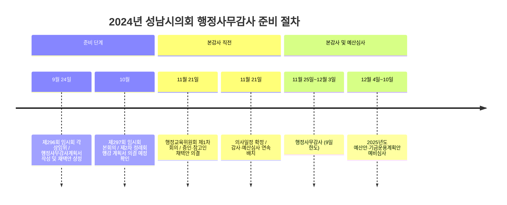
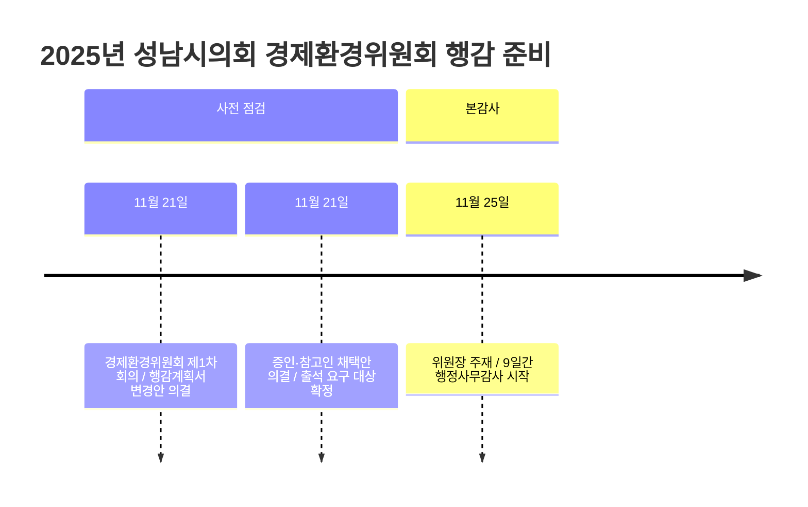

# 2026 성남시의회 행정사무감사 3관점 브리핑

2026년 성남시의회 상임위원회 행정사무감사를 대비하기 위한 실무 자료다. 세 그룹(성남시의원, 성남시청 공무원, 성남시민)이 같은 행감 사실을 확인할 때 각각 우선하는 정보 항목을 분리했다.

조건: 행정사무감사는 제2차 정례회에 집중되며, 5개 상임위원회가 대상이고, 2026년 하반기 세부 일정은 10대 의회 원구성(7월 이후) 후 공식 연간의사일정에 확정된다.

## 1. 감사의 공통 사실 축

### 1-1. 언제 보는가

- 성남시의회 행정사무감사는 제2차 정례회에서 진행된다.
- 법정 한도는 9일 이내다.
- 2026년은 지방선거 결과가 7월 이후 의회 구성을 결정하므로, 그 이후 공식 연간의사일정을 재확인해야 한다.

### 1-2. 무엇을 보는가

| 상임위원회 | 주요 소관 부서·기관 | 감사에서 먼저 볼 항목 |
|---|---|---|
| 의회운영위원회 | 의회사무국 | 의회 내부 운영, 규칙·조례, 의정지원, 윤리·복무 |
| 행정교육위원회 | 공보관, 감사관, 재난안전관, 행정기획조정실, 교육청소년과, 평생교육과, 도서관사업소, 성남시청소년재단, 각 구청 관련 사무 | 홍보, 감사, 재난안전, 교육·청소년, 민원 대응 |
| 경제환경위원회 | AI혁신국, 재정경제국, 환경보건국 일부, 농업기술센터, 푸른도시사업소, 맑은물관리사업소, 성남산업진흥원, 성남시상권활성화재단 | 재정, 세입·세출, 산업정책, 환경, 자원순환, 기후에너지 |
| 문화복지체육위원회 | 복지국, 교육문화체육국 일부, 환경보건국 일부, 3개 보건소, 장례문화사업소, 성남문화재단, 성남시의료원 | 복지, 보건, 공공의료, 문화, 체육, 민간위탁 |
| 도시건설위원회 | 도시주택국, 교통도로국, 문화도시사업단, 차량등록사업소, 성남도시개발공사 | 재개발·재건축, 교통, 도로, 개발사업, 공사·공단 |

### 1-3. 그룹별 우선 검토 항목

- 성남시의원: 질문 전략과 자료 요구 범위
- 성남시청 공무원: 제출 문서와 답변 준비 체계
- 성남시민: 생활·안전·교통·복지·재정에 미치는 영향

## 2. 성남시의원 관점

의원이 행감을 준비할 때는 위원회별 3~5개 질문 축을 먼저 정하고, 같은 사실의 반복 질의를 조정하는 단계가 중요하다.

### 2-1. 위원회별 질문 축

| 위원회 | 질문 축 | 자료 요구의 중심 |
|---|---|---|
| 의회운영위원회 | 의회 운영 체계: 내부 규정·집행·윤리·복무·예산 | 내부 규정, 의정지원 집행, 윤리·복무, 예산 |
| 행정교육위원회 | 안전·감사·교육·청소년 정책 실행: 민원 처리·사고 대응·사업 성과·재단 운영 | 민원 처리, 사고 대응, 교육사업 성과, 재단 운영 |
| 경제환경위원회 | 세입·세출과 산업·환경 정책의 연계성: 예산·출연기관·에너지·자원순환 | 예산 집행, 출연기관 성과, 기후·에너지, 자원순환 |
| 문화복지체육위원회 | 복지·보건·공공의료·문화·체육 서비스 전달: 민간위탁·시설 운영·품질 | 민간위탁, 보건소, 의료원, 시설 운영, 서비스 품질 |
| 도시건설위원회 | 개발·교통 정책: 정비사업·도로·교통대책·공사·공단·민원 대응 | 정비사업, 교통 대책, 공사·공단, 현장 민원 |

### 2-2. 의원용 체크포인트

- 전년도 행감 지적사항의 변화 현황 확인
- 예산 집행률과 사업 결과 중심 질의 준비
- 사업별 담당 부서와 책임자 구분
- 같은 내용의 반복 질의 조정 및 통합
- 2026년 상반기 수정가결·부결·철회 의안과 행감 쟁점의 연계 지점 파악

### 2-3. 위원회별 예시 쟁점

- 의회운영위원회: 의정지원 체계, 내부 규칙 정비, 의원 윤리 기준.
- 행정교육위원회: 재난 대응 체계, 청소년 정책, 도서관·교육사업 성과.
- 경제환경위원회: 세입 기반, 공유재산, 산업 지원, 환경 규제의 실효성.
- 문화복지체육위원회: 복지관·보건소·의료원·문화재단·체육시설 운영.
- 도시건설위원회: 재개발·재건축, 교통유발부담, 노후계획도시, 공공개발.

## 3. 성남시청 공무원 관점

공무원이 행감에 대응할 때는 제출 자료의 일관성이 핵심이다. 수치·근거·책임 부서가 서로 대응되어야 한다.

### 3-1. 감사 전 준비물

- 전년도 행감 시정·처리 요구와 이행 결과
- 예산 집행 현황과 불용·이월 사유
- 민간위탁·출연기관·보조금 정산 자료
- 민원, 사고, 감사 지적, 보도 대응 이력
- 위원회별 소관 사업의 성과지표와 실적표

### 3-2. 답변 원칙

- 숫자는 하나의 기준표를 써서 맞춘다.
- 설명은 현황 → 원인 → 조치 순서로 정리한다.
- 추정은 추정이라고 분리해서 말한다.
- 책임 부서와 협조 부서를 함께 밝힌다.
- 개선 계획은 언제까지, 누가, 무엇을 할지까지 써야 한다.

### 3-3. 부서별로 특히 조심할 점

| 분야 | 공무원이 먼저 챙길 것 |
|---|---|
| 의회운영 관련 사무 | 내부 규정, 의정지원 집행 근거, 답변 문구의 일관성 |
| 행정교육 분야 | 재난·민원 대응 기록, 교육·청소년 사업 성과, 재단 관리자료 |
| 경제환경 분야 | 세입·세출, 공유재산, 산업지원 사업, 환경 기준 준수 자료 |
| 문화복지체육 분야 | 위탁기관 평가, 보건·의료 지표, 시설 운영 실적 |
| 도시건설 분야 | 정비사업 단계별 진행표, 교통대책, 공사·공단 관리자료 |

## 4. 성남시민 관점

행정사무감사는 예산 집행, 안전 대응, 교통 정책, 복지 서비스, 문화시설 운영 같은 일상과 밀접한 사항을 심사하는 절차다.

### 4-1. 시민이 보면 좋은 변화 신호

| 위원회 | 시민이 볼 신호 |
|---|---|
| 의회운영위원회 | 의회 내부 규칙·윤리·규범 준수 현황 |
| 행정교육위원회 | 재난 대응·민원 처리·교육·청소년 지원의 변화 |
| 경제환경위원회 | 상권·에너지·환경·공공재정 정책의 시민 영향 범위 |
| 문화복지체육위원회 | 복지서비스·보건소·의료원·문화·체육시설 운영의 접근성 및 품질 |
| 도시건설위원회 | 재개발·재건축·교통·도로·주차 문제의 현황 및 진행 과정 |

### 4-2. 시민이 확인할 항목

- 예산 증감과 실제 서비스 변화의 대응 여부
- 사업 중복 여부 및 예산 효율성
- 민간위탁 기관의 책임성 감시 체계
- 개발사업에서 주민 의견 반영 과정과 기록
- 전년도 행감 지적사항의 예산·정책 반영 현황

## 5. 일정 읽는 법

### 5-1. 상반기

- 1~3월: 업무보고, 임시회, 결산검사위원 선임.
- 4~6월: 제1차 정례회, 결산, 추경, 시정질문.

### 5-2. 전환기

- 7월: 원구성, 상임위원 선임, 하반기 의사일정 정리.
- 9월: 추경, 감사계획 승인, 행감 자료요구 시작.

### 5-3. 하반기

- 11~12월: 제2차 정례회, 행정사무감사, 내년도 예산안 심의.

### 5-4. 2026년 미확인 사항

- 2026년 하반기 의사일정: 10대 의회 원구성(7월 이후) 시점에 확정될 예정
- 본 자료는 2025년 행감 패턴을 기준으로 11월 감사를 전제하되, 공식 연간의사일정이 나올 때 재검증 필요

### 5-5. 실제 절차는 이렇게 진행된다

| 단계 | 회의 시점 | 공식 기록에서 확인되는 행동 |
| --- | --- | --- |
| 감사 준비 | 정례회 직전~직후 | 상임위 제1차 회의에서 의사일정을 배부하고, 필요하면 행정사무감사계획서 변경안을 먼저 처리한다. |
| 증인·참고인 채택 | 감사 직전 | 증인(참고인) 채택의 건을 의결해 출석 요구 대상을 확정한다. |
| 본감사 | 11월 하순 | 소관 부서·기관을 순차적으로 불러 질의, 자료 확인, 지적사항 정리를 진행한다. |
| 예산심사 연결 | 감사 직후 | 같은 정례회 안에서 다음 연도 예산안·기금운용계획안 예비심사로 바로 넘어간다. |

성남시의회 실무 흐름은 “계획 보완 또는 변경 -> 증인·참고인 확정 -> 9일 한도 감사 -> 예산심사”를 한 묶음으로 보는 편이 맞다.

### 5-6. 2024·2025 공식 기록으로 확인되는 흐름

#### 2024년 행감 준비 단계 (시간축)

#### 2025년 행감 준비 단계 (시간축)

#### 성남시의회 행감 절차 흐름도

#### 2026년 주의사항

- 2024년·2025년 사례에서 감사가 "11월에 갑자기 시작"되지 않음을 확인할 수 있다.
- 9월 감사계획 승인 → 10월 의결 예정 확인 → 11월 계획서 변경 및 증인 채택으로 이어지는 3단계 절차가 관례화되어 있다.
- 조직개편이 있으면 감사 직전에도 계획서 변경이 추가되므로, 조직도와 자료요구 목록을 정례회 개회 직전까지 최신 상태로 유지해야 한다.

## 6. 최종 체크리스트

### 6-1. 성남시의원

- [ ] 위원회별 핵심 쟁점 3개 이상을 정했는가
- [ ] 전년도 지적사항의 재발 여부를 확인했는가
- [ ] 같은 질문의 반복을 줄였는가
- [ ] 예산보다 집행과 성과를 먼저 물을 준비가 됐는가

### 6-2. 성남시청 공무원

- [ ] 숫자 기준표를 통일했는가
- [ ] 전년도 행감 조치 결과를 한 장으로 정리했는가
- [ ] 민간위탁·출연기관 자료를 부서별로 모았는가
- [ ] 개선계획의 책임자와 기한을 적었는가

### 6-3. 성남시민

- [ ] 내 생활과 연결되는 위원회를 찾았는가
- [ ] 예산·안전·교통·복지·문화 중 무엇이 중요한지 정했는가
- [ ] 감사 결과가 실제로 다음 예산에 반영되는지 볼 준비가 됐는가

## 7. 출처

### 7-1. 행감 원본 자료 (성남시의회 공식 링크)

| 자료 | 회의록 페이지 | 다운로드 | 수집시점 |
|---|---|---|---|
| 2024 행정교육위원회 제1차 의사일정안 | [보기](https://www.sncouncil.go.kr/record/recordView.do?key=5256de2f49e0824d89fd4cec73e23fcf23297a1d72cb690903db6ff05625c3c1c170ef72e21b02c1) | [PDF](https://www.sncouncil.go.kr/record/appendixDownload.do?key=782306103666cb015dc1add12153157be71255facc1814df7633f7ed913ca06e1a34212e6c8f41e3) | 2026-06-15 |
| 2024 행정교육위원회 제1차 증인·참고인 채택안 | [보기](https://www.sncouncil.go.kr/record/recordView.do?key=5256de2f49e0824d89fd4cec73e23fcf23297a1d72cb690903db6ff05625c3c1c170ef72e21b02c1) | [PDF](https://www.sncouncil.go.kr/record/appendixDownload.do?key=4607e78c52688aefb5c3fdaa5f79d04ace6f722fefdff0fb10622946e6c422572b1181e93a4addac) | 2026-06-15 |
| 2024 행정교육위원회 제1차 회의록 | [보기](https://www.sncouncil.go.kr/record/recordView.do?key=5256de2f49e0824d89fd4cec73e23fcf23297a1d72cb690903db6ff05625c3c1c170ef72e21b02c1) | [HWP](https://www.sncouncil.go.kr/record/HwpDownload.do?key=5256de2f49e0824d89fd4cec73e23fcf23297a1d72cb690903db6ff05625c3c1c170ef72e21b02c1) | 2026-06-15 |
| 2025 경제환경위원회 제1차 의사일정안 | [보기](https://www.sncouncil.go.kr/record/recordView.do?key=36c0af3efa55f954f80bafeeb080fb4378ef4befeb6bc12056fae4fad2eaf808e869b37fa20c5e52) | [HWP](https://www.sncouncil.go.kr/record/appendixDownload.do?key=06e69f1d39f493b2282a39315c469c9be1dc7f76a613732d753ce6e587201a1a1b2cb8f54a059c51) | 2026-06-15 |
| 2025 경제환경위원회 제1차 행정사무감사계획서 변경안 | [보기](https://www.sncouncil.go.kr/record/recordView.do?key=36c0af3efa55f954f80bafeeb080fb4378ef4befeb6bc12056fae4fad2eaf808e869b37fa20c5e52) | [HWP](https://www.sncouncil.go.kr/record/appendixDownload.do?key=ad979269418f2abc2ae044637f210e69fd992954e1844e4371c96b53721b829e9bef0d7c8c9661da) | 2026-06-15 |
| 2025 경제환경위원회 제1차 증인·참고인 채택안 | [보기](https://www.sncouncil.go.kr/record/recordView.do?key=36c0af3efa55f954f80bafeeb080fb4378ef4befeb6bc12056fae4fad2eaf808e869b37fa20c5e52) | [HWP](https://www.sncouncil.go.kr/record/appendixDownload.do?key=81724b61202af6ab08aa4bd65d5ad3a0d163e04bc5f5a15eba85d9cf39aebae7b0874eb0c36351eb) | 2026-06-15 |
| 2025 경제환경위원회 제1차 회의록 | [보기](https://www.sncouncil.go.kr/record/recordView.do?key=36c0af3efa55f954f80bafeeb080fb4378ef4befeb6bc12056fae4fad2eaf808e869b37fa20c5e52) | [HWP](https://www.sncouncil.go.kr/record/HwpDownload.do?key=36c0af3efa55f954f80bafeeb080fb4378ef4befeb6bc12056fae4fad2eaf808e869b37fa20c5e52) | 2026-06-15 |

### 7-3. 외부 원천

지방자치법, 성남시의회 연간의사일정, 성남시의회 위원회 페이지, 성남시의회 회의록 계층 구조

---
재구성: 내부 결과 문서 5건 바탕 · 원본 수집: 2026-06-15 · 중복 제거 및 출처 통합: 2026-06-16
