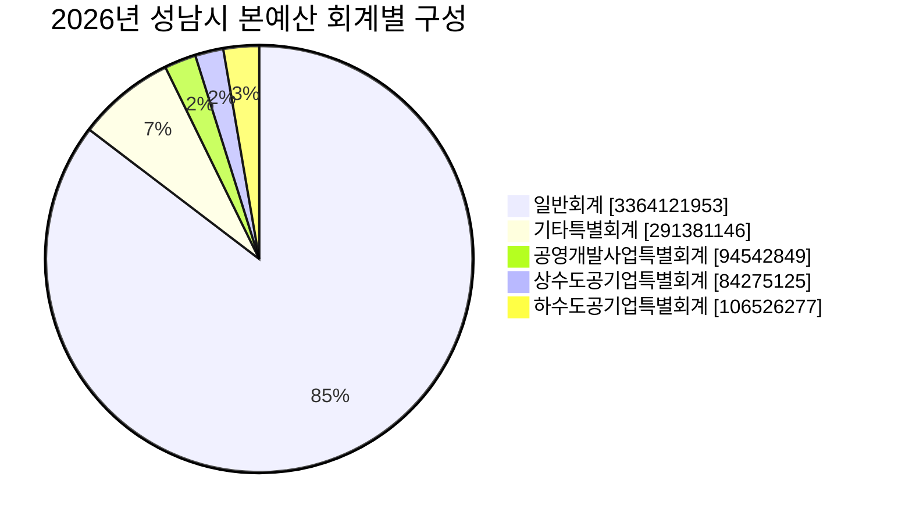

<!-- markdownlint-disable MD013 -->

## 성남시청 2026년 세입세출예산서

2026-06-15 기준 성남시청 예산서 게시판의 2026년 본예산과 1회·2회 추경 구성과
접근 경로를 적는다.

## 1. 조사 개요

| 항목 | 내용 |
| --- | --- |
| 대상 | 성남시청 2026년 세입세출예산서 |
| 접근 위치 | 성남시청 정보공개 > 재정정보 > 예산서 |
| 구조 요약 기준 | 게시판의 파일명과 섹션 제목 |
| 작성 원칙 | 사실(Facts)과 해석(Interpretation) 분리 |

## 2. 접근 경로

| 범주 | 게시판 파일명 | 접근 경로 | 확인 방식 |
| --- | --- | --- | --- |
| 총괄표 | 11608_1.pdf | [성남시청 예산서 게시판](https://www.seongnam.go.kr/city/1000170/339/11608/subTabCont.do) > 2026년 세입세출예산서 > 세입·세출예산규모 및 총괄표 | 바로보기 또는 다운로드 |
| 일반회계 세입 | 11608_2.pdf | 같은 게시판 > 일반회계 > 세입예산사업명세서 | 바로보기 또는 다운로드 |
| 일반회계 세출 | 11608_3.pdf 및 11608_3_1.pdf~11608_3_32.pdf | 같은 게시판 > 일반회계 > 세출예산사업명세서 | 본청 부서·사업소·구청별 파일로 구성 |
| 기타특별회계 | 11608_5.pdf 및 11608_5_1.pdf~11608_5_9.pdf | 같은 게시판 > 기타특별회계 | 회계명별 파일로 구성 |
| 상수도공기업특별회계 | 11608_6.pdf, 11608_6_1.pdf | 같은 게시판 > 상수도공기업특별회계 | 세입·세출 파일이 분리되어 있음 |
| 하수도공기업특별회계 | 11608_7.pdf, 11608_7_1.pdf | 같은 게시판 > 하수도공기업특별회계 | 세입·세출 파일이 분리되어 있음 |
| 공영개발사업특별회계 | 11608_8.pdf, 11608_8_1.pdf | 같은 게시판의 공영개발사업특별회계 블록 | 페이지 소스의 주석 블록에 세입·세출 파일 호출이 남아 있음 |
| 성인지 예산 | 11608_9.pdf | 같은 게시판 > 성인지 예산 | 별도 PDF 1건 |

## 3. 예산서 구조

### 3.1 총괄표

- 세입·세출예산규모 및 총괄표가 별도 PDF로 제공된다.
- 예산서 게시판은 2026년 본예산을 기준으로 일반회계, 기타특별회계, 상수도공기업특별회계, 하수도공기업특별회계, 성인지 예산으로 나뉜다.

### 3.2 일반회계

- 세입예산사업명세서와 세출예산사업명세서가 분리되어 있다.
- 세출예산사업명세서는 본청 국·소·사업소·구청 단위로 세분된다.
- 게시판에서 확인되는 주요 단위는 의회사무국, 소통관, 공보관, 감사관, 재난안전관, 공공의료정책관, 행정기획조정실, 4차산업국, 재정경제국, 복지국, 교육문화체육국, 환경보건국, 도시주택국, 도시정비국, 교통도로국, 공공개발추진단, 수정구보건소, 중원구보건소, 분당구보건소, 농업기술센터, 푸른도시사업소, 맑은물관리사업소, 도서관사업소, 박물관사업소, 차량등록사업소, 장례문화사업소, 수정구청, 중원구청, 분당구청이다.

### 3.3 기타특별회계

- 기타특별회계는 세입예산사업명세서와 세출예산사업명세서가 분리되어 있다.
- 게시판상 확인되는 세부 회계는 발전소주변지역지원사업, 의료급여기금, 기반시설, 토지구획정리, 교통사업, 판교택지개발사업, 도시재생, 폐기물처리시설이다.

### 3.4 공기업특별회계

- 상수도공기업특별회계와 하수도공기업특별회계는 각각 세입·세출이 분리 제공된다.
- 공기업특별회계는 본예산 본문과 분리된 묶음으로 배치된다.
- 페이지 소스의 주석 블록에는 공영개발사업특별회계 세입·세출 파일 호출도 남아 있다.

### 3.5 성인지 예산

- 성인지 예산은 별도 PDF 1건으로 제공된다.
- 파일 존재와 분류를 확인할 수 있다.

## 4. Facts

- 성남시청 예산서 게시판은 2026년 세입세출예산서를 기준으로 일반회계, 기타특별회계, 상수도공기업특별회계, 하수도공기업특별회계, 성인지 예산을 제공한다.
- 예산서의 일반회계 세출은 본청 부서와 사업소, 구청 단위로 세분된다.
- 기타특별회계는 별도 회계 묶음으로 제공되며, 교통사업과 도시재생 같은 정책 사업이 포함된다.
- 본예산 게시판의 페이지 소스에는 공영개발사업특별회계 `11608_8.pdf`, `11608_8_1.pdf` 호출이 남아 있다.

## 5. Interpretation

- 총괄표와 세부 파일이 함께 배치되어 있어 세부 항목까지 내려가서 볼 수 있다.
- 일반회계와 특별회계가 분리되어 있어 본청 정책예산과 공기업·특별회계를 나눠 확인할 수 있다.

## 6. 2026년 1회~4회 추경 세입세출예산서 구조

[추경 예산서 게시판](https://www.seongnam.go.kr/city/1000170/340/11610/subTabCont.do)은
페이지 소스 기준으로 1회부터 4회까지의 추경 파일 호출을 포함한다.
각 추경별 파일 접두사는 `11610_1_*`, `11610_2_*`, `11610_3_*`, `11610_4_*`로 구분된다.

### 6.1 페이지 상위 구조

| 단계 | 내용 |
| --- | --- |
| 1 | 페이지 소스에서 1회, 2회, 3회, 4회 추경 파일 호출이 확인된다. |
| 2 | 각 추경마다 세입·세출예산규모 및 총괄표가 있다. |
| 3 | 세입예산사업명세서와 세출예산사업명세서가 분리되어 있다. |
| 4 | 상수도공기업특별회계와 하수도공기업특별회계는 회차별로 별도 파일로 이어진다. |
| 5 | 공영개발사업특별회계는 회차별로 포함 여부가 다르다. |

### 6.2 1회 추경

- 1회 추경은 `11610_1_1.pdf`, `11610_1_2.pdf`, `11610_1_3.pdf`으로 기본 묶음이 구성된다.
- 상수도공기업특별회계와 하수도공기업특별회계가 별도로 붙는다.
- 페이지 소스의 주석 블록에는 공영개발사업특별회계 `11610_8_1.pdf`, `11610_8_1_1.pdf` 호출이 남아 있다.

### 6.3 2회 추경

- 2회 추경은 `11610_2_1.pdf`, `11610_2_2.pdf`, `11610_2_3.pdf`으로 기본 묶음이 구성된다.
- 페이지 소스의 주석 블록에는 상수도공기업특별회계 `11610_6_2.pdf`, `11610_6_1_2.pdf`와 하수도공기업특별회계 `11610_7_2.pdf`, `11610_7_1_2.pdf` 호출이 남아 있다.
- 공영개발사업특별회계는 `11610_8_1_2.pdf` 세출 파일 호출이 남아 있고, 세입 파일 `11610_8_2.pdf`는 주석 처리된 상태로 보인다.

### 6.4 3회 추경

- 페이지 소스의 주석 블록에는 3회 추경 기본 묶음 `11610_3_1.pdf`, `11610_3_2.pdf`, `11610_3_3.pdf` 호출이 남아 있다.
- 상수도공기업특별회계는 `11610_6_3.pdf`, `11610_6_1_3.pdf`, 하수도공기업특별회계는 `11610_7_3.pdf`, `11610_7_1_3.pdf`로 이어진다.
- 공영개발사업특별회계는 `11610_8_3.pdf`, `11610_8_1_3.pdf` 호출이 남아 있다.

### 6.5 4회 추경

- 4회 추경은 `11610_4_1.pdf`, `11610_4_2.pdf`, `11610_4_3.pdf`으로 기본 묶음이 구성된다.
- 상수도공기업특별회계는 `11610_6_4.pdf`, `11610_6_1_4.pdf`, 하수도공기업특별회계는 `11610_7_4.pdf`, `11610_7_1_4.pdf`로 이어진다.
- 확인한 페이지 소스 범위에서는 4회 추경 공영개발사업특별회계 파일 호출이 보이지 않는다.

### 6.6 확인 순서

| 순서 | 파일 |
| --- | --- |
| 1 | `11610_1_1.pdf` |
| 2 | `11610_1_2.pdf` |
| 3 | `11610_1_3.pdf` |
| 4 | `11610_2_1.pdf` |
| 5 | `11610_2_2.pdf` |
| 6 | `11610_2_3.pdf` |
| 7 | `11610_3_1.pdf` |
| 8 | `11610_3_2.pdf` |
| 9 | `11610_3_3.pdf` |
| 10 | `11610_4_1.pdf` |
| 11 | `11610_4_2.pdf` |
| 12 | `11610_4_3.pdf` |

## 7. 행정안전부 계열 재정정보 사이트

| 사이트 | 운영 주체 | 제공 범위 | 성남시 활용 범위 | 문서 반영 시 주의점 |
| --- | --- | --- | --- | --- |
| [지방재정365](https://www.lofin365.go.kr) | 행정안전부, 한국지역정보개발원 사용자지원 표기 확인 | 예산서, 세부사업별 세출현황, 재정공시, 예산·결산 지표 | 성남시 같은 지방자치단체 단위 재정 비교와 예산·결산 조회에 직접 활용 가능 | 예산 기준과 결산 기준, 회계 구분, 기준연도를 함께 적어야 함 |
| [클린아이](https://www.cleaneye.go.kr) | 행정안전부 저작권 표기, 지방공공기관 책임하 공시 명시 | 지방공기업·출자출연기관 경영공시, 공기업통계, 예산규모 | 성남시 본청 예산서가 아니라 성남시 산하 지방공기업 보조 확인용 | 본청 일반회계·특별회계와 지방공기업 경영공시를 같은 범위로 섞지 않아야 함 |

## 8. NotebookLM 분석 및 시각화

### 8.1 NotebookLM 작업 범위

- NotebookLM 노트북 제목은 `성남시청 2026년 세입세출예산서 본예산 추경 분석`이다.
- 로컬 원본 `2026-budget` 폴더의 PDF 86건을 source로 올렸다.
- 본예산 회계별 예산규모 질의는 `11608_1.pdf`, `11608_5.pdf`, `11608_6.pdf`, `11608_7.pdf`, `11608_8.pdf`를 기준으로 실행했다.
- 추경 구조 질의는 보조적으로 실행했지만, NotebookLM 답변은 추경 PDF 텍스트에서 회차 구조를 안정적으로 식별하지 못했다.
- 따라서 본예산 총액 시각화는 NotebookLM 응답을, 추경 회차 구조 시각화는 성남시청 게시판 HTML 확인 결과를 사용한다.

### 8.2 본예산 회계별 예산규모

NotebookLM 질의 응답 기준 본예산 회계별 예산규모는 다음과 같다.

| 구분 | 예산액(천원) |
| --- | ---: |
| 총계 | 3,940,847,350 |
| 일반회계 | 3,364,121,953 |
| 특별회계 합계 | 576,725,397 |
| 기타특별회계 | 291,381,146 |
| 공기업특별회계 | 285,344,251 |
| 상수도공기업특별회계 | 84,275,125 |
| 하수도공기업특별회계 | 106,526,277 |
| 공영개발사업특별회계 | 94,542,849 |

### 8.3 Mermaid 시각화

```mermaid
flowchart TD
    A[2026 성남시 예산서] --> B[본예산 11608]
    A --> C[1회 추경 11610_1]
    A --> D[2회 추경 11610_2]
    A --> E[3회 추경 11610_3]
    A --> F[4회 추경 11610_4]

    B --> B1[총괄표 11608_1]
    B --> B2[일반회계 세입 11608_2]
    B --> B3[일반회계 세출 11608_3 계열]
    B --> B4[기타특별회계 11608_5 계열]
    B --> B5[상수도 11608_6 / 11608_6_1]
    B --> B6[하수도 11608_7 / 11608_7_1]
    B --> B7[공영개발 11608_8 / 11608_8_1 주석 블록]
    B --> B8[성인지 예산 11608_9]

    C --> C1[총괄표 11610_1_1]
    C --> C2[세입 11610_1_2]
    C --> C3[세출 11610_1_3]
    C --> C4[상수도 11610_6_1 / 11610_6_1_1]
    C --> C5[하수도 11610_7_1 / 11610_7_1_1]
    C --> C6[공영개발 11610_8_1 / 11610_8_1_1 주석 블록]

    D --> D1[총괄표 11610_2_1]
    D --> D2[세입 11610_2_2]
    D --> D3[세출 11610_2_3]
    D --> D4[상수도 11610_6_2 / 11610_6_1_2 주석 블록]
    D --> D5[하수도 11610_7_2 / 11610_7_1_2 주석 블록]
    D --> D6[공영개발 세출 11610_8_1_2]

    E --> E1[총괄표 11610_3_1 주석 블록]
    E --> E2[세입 11610_3_2 주석 블록]
    E --> E3[세출 11610_3_3 주석 블록]
    E --> E4[상수도 11610_6_3 / 11610_6_1_3 주석 블록]
    E --> E5[하수도 11610_7_3 / 11610_7_1_3 주석 블록]
    E --> E6[공영개발 11610_8_3 / 11610_8_1_3 주석 블록]

    F --> F1[총괄표 11610_4_1]
    F --> F2[세입 11610_4_2]
    F --> F3[세출 11610_4_3]
    F --> F4[상수도 11610_6_4 / 11610_6_1_4]
    F --> F5[하수도 11610_7_4 / 11610_7_1_4]
    F --> F6[공영개발 미확인]
```

## 9. 출처

- [성남시청 예산서 게시판](https://www.seongnam.go.kr/city/1000170/339/11608/subTabCont.do)
- [성남시청 추경 예산서 게시판](https://www.seongnam.go.kr/city/1000170/340/11610/subTabCont.do)
- [지방재정365](https://www.lofin365.go.kr)
- [클린아이](https://www.cleaneye.go.kr)
- NotebookLM 노트북 `성남시청 2026년 세입세출예산서 본예산 추경 분석` · source 86건 업로드 후 질의

---
