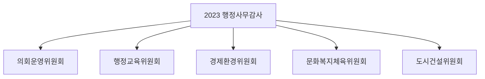
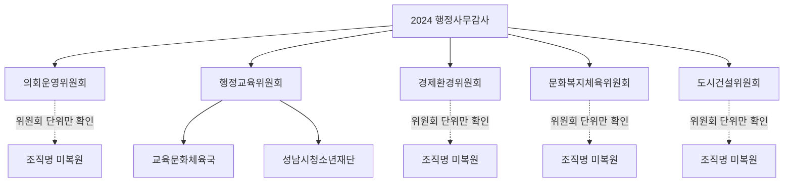
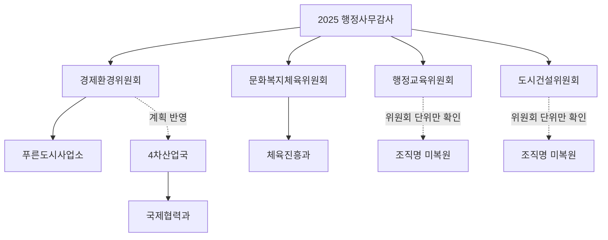

## 2023-2025 성남시의회 상임위원회 행정사무감사 수집 결과

이 문서는 self-contained다. JSONL manifest나 외부 요약 문서에 의존하지 않고, 직접 회의록 URL과 짧은 설명만 담는다.

<!-- markdownlint-disable MD013 -->

## 관계도

## 직접 확인한 관계

- 2024 행정교육위원회 -> 교육문화체육국, 성남시청소년재단.
- 2025 경제환경위원회 -> 푸른도시사업소.
- 2025 경제환경위원회 -> 4차산업국 -> 국제협력과. 이건 행정사무감사계획서 변경에 반영된 조직이다.
- 2025 문화복지체육위원회 -> 체육진흥과.
- 2023, 2024, 2025의 나머지 위원회는 회의록에서 행정사무감사 실시 사실은 확인되지만, 이 문서가 보는 텍스트 조각만으로는 개별 조직명을 끝까지 복원하지 못했다.

## URL 목록

### Y2023

- 2023 의회운영위원회 1차 - [recordView](https://www.sncouncil.go.kr/record/recordView.do?key=a966cdc5bfe1ce7c8bf645c4c01ce463f48bebb62d262112af261ec2713e20bff351073f3625f93d) - 제289회 제2차 정례회 개회. 행정사무감사 일정은 위원회 단위까지만 확인.
- 2023 행정교육위원회 1차 - [recordView](https://www.sncouncil.go.kr/record/recordView.do?key=ce22956785a6fc33a9f12907340d64547f28029d02b202d6cc857a74240e9e92b0522ce695761d65) - 2023년도 행정사무감사를 11월 23일~12월 1일에 실시한다고 명시.
- 2023 경제환경위원회 1차 - [recordView](https://www.sncouncil.go.kr/record/recordView.do?key=a212b4d7310d2c36d5c9d4f116fb86f486ef430672ba8c9e381c97bffe6c99ccb430e40c52ce0da6) - 2023년도 행정사무감사와 2024년도 예산안 예비심사를 함께 예고.
- 2023 문화복지체육위원회 1차 - [recordView](https://www.sncouncil.go.kr/record/recordView.do?key=a891c78517126c2c3282446f9bda36ab9909048f68fee5a61d09267cb6ebf72d540bff242ceb3f46) - 2023년도 행정사무감사와 2024년도 예산안 예비심사 예고.
- 2023 도시건설위원회 1차 - [recordView](https://www.sncouncil.go.kr/record/recordView.do?key=7e9b134c9b11e4c8e40e2e97b645a7fd0b827d4fde0fd83ff4368c490a5d05c01ca2139c63070430) - 행정사무감사 공백 논의가 나오지만, 개별 조직명은 이 조각에서 복원되지 않음.

### Y2024

- 2024 의회운영위원회 1차 - [recordView](https://www.sncouncil.go.kr/record/recordView.do?key=c47a2e61e25268b877229228fb32ecd195b6386bcd1516e878ab7ec1a7d4f4c0b51d730afdc61ca7) - 제298회 제2차 정례회 개회.
- 2024 행정교육위원회 1차 - [recordView](https://www.sncouncil.go.kr/record/recordView.do?key=5256de2f49e0824d89fd4cec73e23fcf23297a1d72cb690903db6ff05625c3c1c170ef72e21b02c1) - 2024년도 행정사무감사 증인(참고인) 채택의 건.
- 2024 행정교육위원회 2차 - [recordView](https://www.sncouncil.go.kr/record/recordView.do?key=51bd45c2bdae1eb67b05c91f85c92fee4e6a73ac59666c912f619f9472a903eff1fd75e7aef466e4) - 교육문화체육국과 성남시청소년재단 소관 업무에 대한 2024년도 행정사무감사.
- 2024 경제환경위원회 1차 - [recordView](https://www.sncouncil.go.kr/record/recordView.do?key=8cd40a4e977f397e1b40c7218ee3a0a6973a590502068752d399183b40f2dbaf3f70ac02af493603) - 2024년도 행정사무감사 관련 일정과 예비심사.
- 2024 문화복지체육위원회 1차 - [recordView](https://www.sncouncil.go.kr/record/recordView.do?key=8df2027b1eb7b82e8fd9f45087fad43b6ad66a594355a60398677a02d5084d05dc8f7d2f7402ea90) - 2024년도 행정사무감사 관련 일정과 예비심사.
- 2024 도시건설위원회 1차 - [recordView](https://www.sncouncil.go.kr/record/recordView.do?key=35786a268395456a70e35854d79d3683c638ca7fed4c32914cce8a86c71e86d01f1fd259ad93533b) - 제298회 제2차 정례회 개회.

### Y2025

- 2025 행정교육위원회 1차 - [recordView](https://www.sncouncil.go.kr/record/recordView.do?key=a56986bd71a7e5bd0f407018149717290ec289483156712b62559bd9720a46a5c1ae55db162987c5) - 행정사무감사 거부 논쟁이 있으나, 이 텍스트 조각만으로는 개별 조직명 복원 불가.
- 2025 경제환경위원회 1차 - [recordView](https://www.sncouncil.go.kr/record/recordView.do?key=36c0af3efa55f954f80bafeeb080fb4378ef4befeb6bc12056fae4fad2eaf808e869b37fa20c5e52) - 2025년도 행정사무감사계획서 변경의 건, 4차산업국 국제협력과 신설 반영.
- 2025 경제환경위원회 2차 - [recordView](https://www.sncouncil.go.kr/record/recordView.do?key=917e2983f807cde5c5a4eaaa0ed4fd1c3db6e95a2062ad4d05d5a4b51be59142b49e3f44c345b528) - 푸른도시사업소 소관 업무에 대한 2025년도 행정사무감사.
- 2025 문화복지체육위원회 1차 - [recordView](https://www.sncouncil.go.kr/record/recordView.do?key=1bf4eadddf71d8f403649191b8aa8eaa0cbab72afebde8b6abe0c0aaec5d95153bdeed46c70a47a2) - 2025년도 행정사무감사와 2026년도 예산안 예비심사.
- 2025 문화복지체육위원회 2차 - [recordView](https://www.sncouncil.go.kr/record/recordView.do?key=b391248683febe40136b7e76ef234b08316e944c6e8fb2b1aa2cf4c1e1d13fa891f701c5e36e762b) - 체육진흥과 행정사무감사 관련 비공개 결정.
- 2025 도시건설위원회 1차 - [recordView](https://www.sncouncil.go.kr/record/recordView.do?key=4eb38c6010f6ba32d98a2cf7f96f2dfcb80bcd0febf4b384fd0b2f2b03d7641f395ce2d08f4f8f08) - 2025년도 행정사무감사와 예산안 예비심사.
- 2025 도시건설위원회 2차 - [recordView](https://www.sncouncil.go.kr/record/recordView.do?key=a6b51cfd4d20e7606a90bd1415a70abd289f556c98e36b693dcb21fde113f5a398a677f9caca2e8d) - 제307회 제2차 정례회 제2차 도시건설위원회 회의록.

## 정리

- 2024년은 행정교육위원회에서 조직명까지 직접 확인된다.
- 2025년은 경제환경위원회와 문화복지체육위원회에서 조직명까지 직접 확인된다.
- 2023년은 위원회 단위 행정사무감사 개최 사실은 확인되지만, 이 문서에 넣은 텍스트 조각만으로는 감사 대상 조직명을 끝까지 복원하지 못했다.
